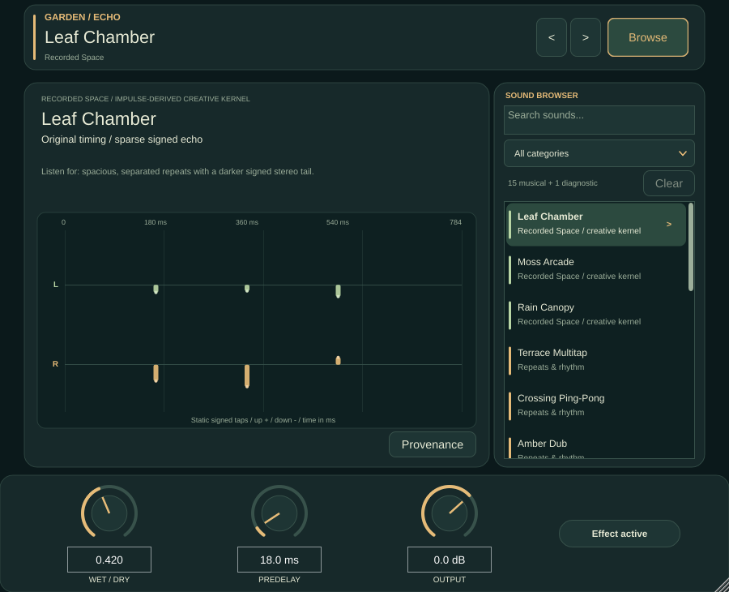

# Garden Echo

**A garden of stereo echoes, moving colour and spacious delays.** Garden Echo 0.2.0 is a native stereo VST3 effect: choose from 15 musical sounds, then shape how much of the original track remains. Three impulse-derived creative spaces sit alongside twelve locally authored classical-DSP studies. **Unit impulse** is a separate alignment diagnostic, not a preset for music.

> **Status:** open-source release candidate. A packaged binary is not offered from this page, and no contest submission is claimed. The owner has approved public source and included-media redistribution. Binary distribution and physical listening remain separate release gates. See [release status](docs/PUBLIC_RELEASE_STATUS.md).

### Native binary targets

VST3 standardizes the plugin interface, **not the compiled machine code**. Use
the bundle built for your OS and processor; changing its filename cannot convert it.

| Target | Current validation boundary |
|---|---|
| Linux x86_64 | Local CTest and pluginval strictness 5 passed; review module requires GLIBC_2.38. |
| Windows x64 | Native build and CTest workflow prepared; results are not yet claimed. |
| macOS universal | Intel + Apple Silicon build, architecture checks and native tests on both runner types prepared; results are not yet claimed. |

Follow [native build runs](https://github.com/mojomast/garden-echo-vst/actions/workflows/native-vst3.yml)
and [packaging instructions](docs/NATIVE_PACKAGING.md). Build artifacts are
candidates, not DAW/listening certification. macOS signing/notarization is a
separate distribution step; no Developer ID credentials are embedded here.



*Actual native component capture from UI verification, not a DAW screenshot or proof of listening. [Larger editor](evidence/ui/component-1280x1000.png) · [study controls and schematic in a standalone capture](evidence/ui/study-default-900x730.png) (standalone window shows a muted-audio warning) · [compact editor](evidence/ui/component-710x645.png). The final headless REAPER editor capture is obscured by an audio-device modal, so it is deliberately not shown here.*

## Start playing

1. In a Linux VST3 host, insert **Garden Echo** on an audio track (mono or stereo). Start with **Leaf Chamber** on a short phrase with space after it; the repeats need room to be heard. The default Wet/Dry is **0.42** and Predelay **18 ms**.
2. Click **Browse** to search or filter sounds, or use **< / >** to move through the 15 musical selections. Click a result to choose it. Search and filtering do **not** change the playing sound until you select a result. The arrows skip Unit impulse.
3. For an **insert**, keep some dry signal (try Wet/Dry 0.25–0.50). For a parallel **send/return**, set Wet/Dry to **1.0** so the return contains only the processed path; set the send and return level in your host, then bring up the effect carefully. If your host already supplies latency compensation, leave it enabled. Compare at matched loudness, especially when switching sounds.
4. Try **Predelay** to separate an attack from its wet response, **Output** to trim the result, and **Effect active** to compare with bypass. Bypass crossfades toward the unprocessed input; it is not a host mute. Leave headroom on the track and return: feedback, resonance and summed dry/wet paths can make peaks louder than expected.

### Controls

| Editor control | Range · default | Use |
|---|---|---|
| **Wet/Dry** | 0–1 · **0.42** | 0 = original input; 1 = processed path only. |
| **Predelay** | 0–250 ms · **18 ms** | Delays the wet path, including the studies. |
| **Output** | −24 to +12 dB · **0 dB** | Trims the active mixed output, not the host's input gain. |
| **Effect active / Bypassed** | active | Smoothly crossfades to dry input when bypassed. |
| **Time** | 0–1 · **0.50** | Scales study delay timing. |
| **Feedback** | 0–1 · **0.50** | Changes repeat amount where applicable. |
| **Colour** | 0–1 · **0.50** | Changes damping/filter openness where applicable. |
| **Motion** | 0–1 · **0.50** | Changes applicable modulation depth/rate. |

The four study macros are normalized controls, **not tempo-sync values**. Only applicable macros appear in the editor: Prism hides Feedback; Mist hides Colour; Motion is shown for Amber, Petal, Canopy, Ribbon, Lantern, Brook and Prism. Hidden macros remain host parameters. Enter a value in the numeric field; double-click a dial to restore its default. Resize the editor from **710 × 645** to **1280 × 1000** (default **900 × 730**); at compact widths an open browser replaces the detail panel, while the common controls remain visible.

**Finding a sound:** Browse offers All categories, Recorded Spaces, Effect Studies, Diagnostic and four study families. Search matches names and descriptive terms; **Clear** resets search and category. With the list focused, **Up/Down, Home/End** move its cursor, **Enter** selects, and **Escape** closes Browse; a double-click selects and closes. Enter in the search field chooses the first match. Keyboard behavior depends on focus in the host. **Provenance** expands the selected sound's source details. The recorded-space L/R signed tap map is static bundled metadata; study diagrams are illustrative, **not live analysers**.

## The sounds

These descriptions and the ideas below are guides to what to try, **not claims from a physical listening evaluation**.

| Recorded space | Character |
|---|---|
| **Leaf Chamber** | Staggered signed stereo echoes; try a sparse pluck. |
| **Moss Arcade** | Faster, damped reflections; try short percussion. |
| **Rain Canopy** | Slower, damped, inverted and stereo-swapped echoes; try a sustained chord. |

| Effect study | Family | Suggested starting material |
|---|---|---|
| **Terrace Multitap** | Repeats & rhythm | Sparse early taps after an attack. |
| **Crossing Ping-Pong** | Repeats & rhythm | Alternating stereo answers from a centered note. |
| **Amber Dub** | Repeats & rhythm | Dark filtered feedback behind a short phrase. |
| **Petal Chorus** | Moving & widening | Short moving delay on a sustained part. |
| **Canopy Ensemble** | Moving & widening | Three detuned voices around a chord. |
| **Ribbon Flanger** | Moving & widening | Swept comb colour on a steady tone. |
| **Wire Resonator** | Tone & resonance | A damped tuned ring after a pluck. |
| **Mist Diffuser** | Texture & pulse | All-pass softening of a transient. |
| **Lantern Tremolo Echo** | Texture & pulse | Opposing stereo pulses on a rhythmic part. |
| **Brook Filter Sweep** | Tone & resonance | Moving low-pass colour on a short echo. |
| **Prism Stereo Doubler** | Moving & widening | Asymmetric short delays for subtle width. |
| **Steps Rhythmic Taps** | Repeats & rhythm | Signed, syncopated accents against a beat. |

**Unit impulse** uses a positive unit-tap kernel in each channel at 0 ms for alignment diagnosis; it passes incoming audio through that response rather than generating a test signal. Shared mix, predelay and output still apply. It is available under Diagnostic, but not in Previous/Next's musical cycle. For an audition exhibit, the [effects bank](effects-bank/manifest.json) indexes three four-second dry cues and 36 matched native renders (12 studies × drum/pluck/chord); its wet audition trim and settings are documented there, and these are not level-matched listening results.

### Starting-point recipes

- **Percussive distance:** Terrace Multitap, Wet/Dry around 0.30, Predelay around 25 ms; leave space after hits and adjust Time to taste.
- **Wide sustained texture:** Petal Chorus or Canopy Ensemble, Wet/Dry around 0.35, Motion near its 0.50 default; check mono compatibility and back off if the part loses focus.
- **Dub return:** Amber Dub on a send, Wet/Dry 1.0, start Feedback below 0.50 and return level low; raise gradually while watching peaks.
- **Subtle double:** Prism Stereo Doubler, Wet/Dry around 0.25 on an insert; compare against dry at equal perceived level.

These are **suggested starting positions**, not tested mix settings or verified listening outcomes.

## Installation and compatibility

There is **no public binary download linked here**. If you have an owner-authorized review archive, extract it first, then run from its extracted root (which contains `Garden Echo.vst3`):

```sh
mkdir -p "$HOME/.vst3"
cp -a 'Garden Echo.vst3' "$HOME/.vst3/"
# Rescan VST3 plugins in your host, then insert Garden Echo.
```

Copy the **entire bundle**, not just its internal `.so`. To uninstall this user-level copy, close the host, then remove **only** this named bundle and rescan:

```sh
rm -rf -- "$HOME/.vst3/Garden Echo.vst3"
```

The candidate was tested on Linux x86_64; the final module's maximum observed required symbol is **GLIBC_2.38**. This is a compatibility floor indicator, **not a guarantee** on every distro with that glibc. Older Linux systems and physical audio hardware have not been validated. No Windows, macOS or AU binary is packaged or claimed. The standalone build is diagnostic, not the VST3 deliverable.

For an eventual **Windows x64** candidate, close the host and copy the whole
`Garden Echo.vst3` bundle into `C:\Program Files\Common Files\VST3\` (administrator
permission may be required), then rescan. A host-specific user VST3 folder is
an alternative only if your host supports it. Remove only that named bundle to
uninstall. A Microsoft Visual C++ runtime may be required; inspect the candidate's
dependency receipt rather than assuming it is self-contained.

For an eventual **macOS universal** candidate, close the host and copy the whole
bundle into `~/Library/Audio/Plug-Ins/VST3/`, then rescan. Remove only that bundle
to uninstall. Universal means **two macOS CPU slices**, not Windows/Linux support.
Unsigned or ad-hoc-signed candidates are not Developer ID signed or notarized;
Gatekeeper/host policy may block them. Do not disable system security globally.

## Sessions, performance and problems

The host can automate the sound choices (Space/Study), common controls, bypass and all four study macros. Choosing a study retains the previously chosen recorded space for a later return; changing sounds does not reset Wet/Dry, Predelay or Output. State stores parameters and the selected kernel ID/SHA-256. If the kernel identity no longer matches, restore falls back to Unit impulse instead of silently loading a different kernel. Changes are smoothed and processing histories remain warm, so a tail may carry across a switch. Save and reopen a test session before relying on complex automation in a new host.

Four always-warm convolution engines trade CPU/memory for continuous transitions. For a busy session, freeze/bounce tracks in the host, avoid stacking many instances unnecessarily, and measure CPU at your intended sample rate and block size; do not treat a successful offline render as a realtime headroom guarantee. Keep input/output meters below clipping, especially with Feedback and resonant studies.

| Symptom | Check |
|---|---|
| Plugin missing | Verify the **whole** bundle is in `~/.vst3/`, rescan, check host VST3 support and Linux x86_64/glibc compatibility. |
| No change heard | Feed audio, check the host's track/send routing and plugin bypass, then raise Wet/Dry. Unit impulse at default settings is primarily a diagnostic. |
| Too loud or muddy | Lower the return/send, Wet/Dry or Output; reduce Feedback and audition on a short phrase with a gap. |
| Sound selection seems unchanged | Search/filtering only narrows the list; select a result. Check bypass and whether the effect needs a tail or stereo material. |
| Host crash or GUI problem | Record host version, distro/glibc, plugin path and reproduction steps; consult [known limitations](evidence/KNOWN_LIMITATIONS.md). Do not assume another platform is supported. |

## What the provenance and tests actually establish

The three recorded-space kernels are **local creative variations of one recorded Atlas `otoc-echo-v1` simulator trajectory** (`backend:aer`, `mode:emu`) and **one `retrocausal-echo-v1` explicit-unit-impulse render**. They are not three independent remote experiments or measured physical rooms. Twelve studies use native classical DSP informed by archived simulator-derived mappings. Incoming audio is processed locally: the VST3 makes **no Atlas or network requests**. There is no hardware-execution or quantum-advantage claim. See the [provenance index](evidence/PROVENANCE.json) and [recorded source audit](evidence/recorded-source-audit.md).

The Linux build has [CTest and pluginval strictness-5 receipts](evidence/release-readiness/VST_RELEASE_VERIFICATION.md); historical REAPER reopen/offline-render evidence is summarized there. pluginval's optional external Steinberg validator was unavailable; the headless REAPER GUI create was obstructed by an audio-device modal. Screen-reader use, physical HiDPI and physical-audio listening remain unverified. Test results are **not** a blanket cross-host or release-approval claim. [UI guide](docs/RELEASE_UI_GUIDE.md) · [test report](evidence/TEST_REPORT.md) · [limitations](evidence/KNOWN_LIMITATIONS.md).

## Build from source and licensing

Use a separate JUCE **8.0.15** checkout at commit `91ad83ae34a81e0833b1a2b0866f54846370ae53`, plus the Linux compiler/CMake/Ninja/Python and development libraries in the [reproduction guide](submission/REPRODUCE.md). No dependencies are downloaded by these commands:

```sh
cmake -S . -B build/ship-final -G Ninja -DCMAKE_BUILD_TYPE=Release -DJUCE_ROOT=/path/to/pinned/JUCE
cmake --build build/ship-final --target GardenEcho_VST3 EchoChecks EffectCoreChecks StateMigrationChecks --parallel 2
ctest --test-dir build/ship-final --output-on-failure
python3 scripts/verify_ship_inventory.py
```

The output bundle is `build/ship-final/GardenEcho_artefacts/Release/VST3/Garden Echo.vst3`. Platform dependencies and the original authoring-input limitations are detailed in [REPRODUCE](submission/REPRODUCE.md). Project source is offered under [GNU AGPLv3](LICENSE); pinned JUCE is **AGPLv3 or commercial**, and the VST3 SDK notice is MIT. The SDK license does not remove JUCE obligations. Read [third-party notices](THIRD_PARTY_NOTICES.md), [credits](submission/CREDITS.md) and [release status](docs/PUBLIC_RELEASE_STATUS.md) before distributing binaries.
